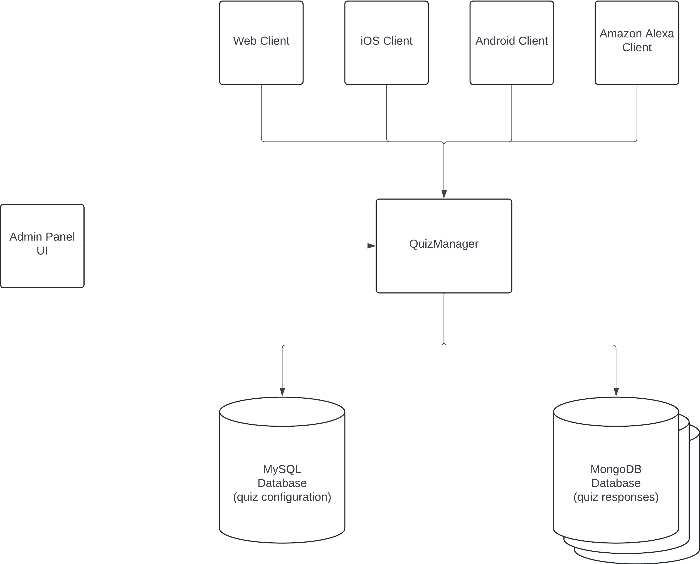
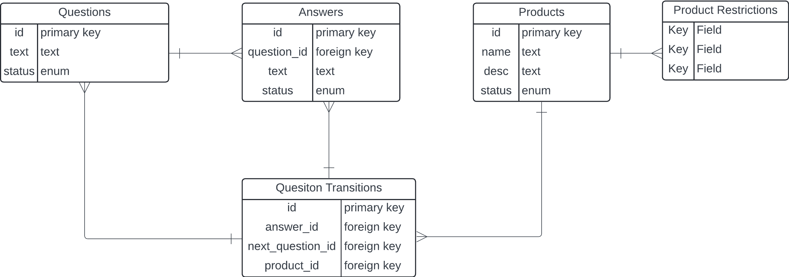

# System Design

The system allows the configuration and responding to quizzes in a horizontally scalable, auditable, reliable and high-performant way.

## Pros
- Continent-scale horizontal scalability.
- Complete historical traceability on why a product has been recommended.
- Sub 10ms p95 response time on requests.
- Easily extensible to many clients such as mobile apps, voice assistants and MDs assistant tools.

## Cons
- More complicated backend state management.
- API endpoints for quiz filling are not rest-standard.

## Todo
- Add support for users and multiple quizzes for a user.
- Remove relational entities and unify model around document model.
- Product restrictions allow/disallow is currently unused.
- Add authentication and authorization. Session management.
- Add connection pooling for the db connections.
- Bug fixes, bug fixes and bug fixes - react state management, multi-product suggestions corner cases and others.





# Database Design

## MySQL Schema



## MongoDB Schema

```
 {
    _id: ObjectId('66e70fbcf9d781a3b50aa65f'),
    quiz_id: 9,
    progress: {
      answers_given: [
        { question_id: 1, answer_id: 2 },
        { question_id: 2, answer_id: 4 }
      ],
      current_question_id: 2,
      recommended_products: [
        { id: 2, name: 'name1', description: 'desc1', status: 'draft' }
      ]
    },
    quiz_snapshot: {
      questions: [
        {
          id: 1,
          text: 'am i old',
          status: 'published',
          answers: [
            { id: 2, text: 'no', status: 'published' },
            { id: 1, text: 'yes', status: 'published' }
          ]
        },
        {
          id: 2,
          text: 'am i pretty',
          status: 'published',
          answers: [
            { id: 5, text: 'no', status: 'published' },
            { id: 4, text: 'maybe', status: 'published' },
            { id: 3, text: 'yes', status: 'published' }
          ]
        }
      ],
      products: [
        { id: 2, name: 'name1', description: 'desc1', status: 'draft' },
        { id: 3, name: 'name2', description: 'desc2', status: 'draft' },
        {
          id: 4,
          name: 'dyson',
          description: 'hairdryer',
          status: 'draft'
        }
      ],
      product_restrictions: [],
      quiz_rules: [
        { id: 1, answer_id: 1, next_question_id: 2, product_id: null },
        { id: 2, answer_id: 2, next_question_id: 2, product_id: null },
        { id: 4, answer_id: 3, next_question_id: null, product_id: 2 },
        { id: 5, answer_id: 4, next_question_id: null, product_id: 2 },
        { id: 6, answer_id: 5, next_question_id: null, product_id: 3 }
      ]
    }
  }
]

```

# Launch Instructions

### Python Backend (Flask API)

To run the Python backend, ensure you have Python and `pip` installed on your machine.

1. **Clone the Repository:**

   Open your terminal and run:

```
 git clone <repository-url>
 cd <repository-folder>
```

2. Create a Virtual Environment:

It is a good practice to create a virtual environment for your Python dependencies.

```
python -m venv venv
source venv/bin/activate
```

3. Install Dependencies:

Install the required Python dependencies using pip:

bash
```
pip install -r requirements.txt
```

3. Configura databases:

Update database configuration in services/db_config.py

```
DB_CONFIG = {
    'user': 'root',
    'password': '',
    'host': 'localhost',
    'database': 'manual',
}

from pymongo import MongoClient

MONGO_URI = "mongodb://localhost:27017/"
mongo_client = MongoClient(MONGO_URI)
mongo_db = mongo_client["manual"]
quiz_collection = mongo_db["quizes"]
```

5. Run the Flask Application:

Run the backend using Flask:

```
flask run
```

6. Run the frontend

```
cd client
npm install
npm start
```

This will open the React app in your default browser at http://localhost:3000.


# API Endpoints

## Admin Endpoints

#### Products Management
| Endpoint                              | Method | Description                |
|---------------------------------------|--------|----------------------------|
| [Create Product](#create-product)     | POST   | Create a new product.       |
| [Update Product](#update-product)     | PUT    | Update a product.           |
| [Get All Products](#get-all-products) | GET    | Retrieve all products.      |
| [Publish Product](#publish-product)   | POST   | Publish a product by ID.    |
| [Disable Product](#disable-product)   | POST   | Disable a product by ID.    |

#### Questions Management
| Endpoint                              | Method | Description                |
|---------------------------------------|--------|----------------------------|
| [Create Question](#create-question)   | POST   | Create a new quiz question.                         |
| [Get All Answers](#get-all-answers)   | GET    | Retrieve all answers with their associated questions.|
| [Publish Question](#publish-question) | POST   | Publish a quiz question by ID.                      |
| [Disable Question](#disable-question) | POST   | Disable a quiz question by ID.                      |
| [Create Answer](#create-answer)       | POST   | Create a new answer to a quiz question.             |
| [Publish Answer](#publish-answer)     | POST   | Publish a quiz answer by ID.                        |
| [Disable Answer](#disable-answer)     | POST   | Disable a quiz answer by ID.                        |

#### Product Restrictions Management
| Endpoint                              | Method | Description                |
|---------------------------------------|--------|----------------------------|
| [Create Restriction](#create-restriction)             | POST   | Create a product restriction based on an answer ID. |
| [Remove Restriction](#remove-restriction)             | DELETE | Remove a product restriction by ID.                 |
| [Get Product Restrictions](#get-product-restrictions) | GET    | Retrieve product restrictions for a given answer.   |

#### Question Transitions Management
| Endpoint                                                                   | Method | Description                           |
|----------------------------------------------------------------------------|--------|---------------------------------------|
| [Create Question Transition Rule](#create-question-transition-rule)        | POST   | Create a new question transition.     |
| [Get All Question Transition Rules](#get-all-question-transition-rules)    | GET    | Retrieve all question transitions.    |
| [Get Question Transition by ID](#get-question-transition-rule-by-id)       | GET    | Retrieve a question transition by ID. |
| [Update Question Transition by ID](#update-question-transition-rule-by-id) | PUT    | Update a question transition by ID.   |
| [Delete Question Transition by ID](#delete-question-transition-rule-by-id) | DELETE | Delete a question transition by ID.   |

## Quiz Run Endpoints

| Quiz Endpoint                                             | Method | Description                | Quiz Endpoint                                 | Method | Description                |
|-----------------------------------------------------------|--------|----------------------------|-----------------------------------------------|--------|----------------------------|
| [Get Current Question](#get-current-question)             | GET    | Get the current question.         | [Get Current Question](#get-current-question) | GET    | Get the current question.         |
| [Answer Question](#answer-question)                       | POST   | Answer the current question.      | [Answer Question](#answer-question)           | POST   | Answer the current question.      |
| [Reset to Previous Question](#reset-to-previous-question) | POST   | Reanswer a previously answered question. | [Reanswer Question](#reanswer-question)       | POST   | Reanswer a previously answered question. |

---


### Create Product
- **URL**: `/api/product`
- **Method**: `POST`
- **Description**: Creates a new product.
- **Request Body**:
    ```json
    {
        "name": "Product Name",
        "description": "Product Description"
    }
    ```
- **Curl Example**:
    ```bash
    curl -X POST http://127.0.0.1:5000/api/product \
    -H "Content-Type: application/json" \
    -d '{"name": "New Product", "description": "Description of the product"}'
    ```
- **Response**:
    ```json
    {
        "message": "Product created successfully"
    }
    ```

---

### Publish Product
- **URL**: `/api/product/<product_id>/publish`
- **Method**: `POST`
- **Description**: Publishes a product by setting its status to 'published'.
- **Curl Example**:
    ```bash
    curl -X POST http://127.0.0.1:5000/api/product/1/publish
    ```
- **Response**:
    ```json
    {
        "message": "Product published successfully"
    }
    ```

---

### Disable Product
- **URL**: `/api/product/<product_id>/disable`
- **Method**: `POST`
- **Description**: Disables a product by setting its status to 'disabled'.
- **Curl Example**:
    ```bash
    curl -X POST http://127.0.0.1:5000/api/product/1/disable
    ```
- **Response**:
    ```json
    {
        "message": "Product disabled successfully"
    }
    ```

---

### Get All Products
- **URL**: `/api/product/products`
- **Method**: `GET`
- **Description**: Retrieves a list of all products.
- **Curl Example**:
    ```bash
    curl -X GET http://127.0.0.1:5000/api/product/products
    ```
- **Response**:
    ```json
    [
        {
            "id": 1,
            "name": "Product 1",
            "description": "Description of Product 1",
            "status": "published"
        },
        {
            "id": 2,
            "name": "Product 2",
            "description": "Description of Product 2",
            "status": "draft"
        }
    ]
    ```

---

### Update a Product
- **URL**: `/api/product/<product_id>`
- **Method**: `PUT`
- **Description**: Updates a product's details.
- **Request Body**:
    ```json
    {
        "name": "Updated Product Name",
        "description": "Updated Product Description",
        "status": "published"
    }
    ```
- **Curl Example**:
    ```bash
    curl -X PUT http://127.0.0.1:5000/api/product/1 \
    -H "Content-Type: application/json" \
    -d '{"name": "Updated Product Name", "description": "Updated Description", "status": "published"}'
    ```
- **Response**:
    ```json
    {
        "message": "Product updated successfully"
    }
    ```

---

### Delete Product
- **URL**: `/api/product/<product_id>`
- **Method**: `DELETE`
- **Description**: Deletes a product by its ID (if deletion is supported).
- **Curl Example**:
    ```bash
    curl -X DELETE http://127.0.0.1:5000/api/product/1
    ```
- **Response**:
    ```json
    {
        "message": "Product deleted successfully"
    }
    ```

### Get Current Question

- **URL**: `/filler/<int:quiz_id>/current_question`
- **Method**: `GET`
  - **Description**: Retrieves the current question state for the given quiz or create a new quiz if no such exists.
  - Response will contain field answers_given if previous answers have been given and will contain recommended_products if recommendations have been made.

    - **Curl Example**:
        ```bash
        curl -X GET http://127.0.0.1:5000/api/filler/5/current_question
        ```

      - **Response**:

          ```json
          {
            "answers_given": [
              {
                "answer_id": 2,
                "question_id": 1
              }
            ],
            "current_question": {
              "answers": [
                {
                  "id": 5,
                  "status": "published",
                  "text": "no"
                },
                {
                  "id": 4,
                  "status": "disabled",
                  "text": "maybe"
                },
                {
                  "id": 3,
                  "status": "published",
                  "text": "yes"
                }
              ],
              "id": 2,
              "status": "published",
              "text": "am i pretty"
            }
          }

        ```

        - **If product recommendations are available**:
        ```json
      
        {
          "answers_given": [
            {
              "answer_id": 2,
              "question_id": 1
            },
            {
              "answer_id": 4,
              "question_id": 2
            }
          ],
          "recommended_products": [
            {
              "description": "desc1",
              "id": 2,
              "name": "name1",
              "status": "draft"
            },
            {
              "description": "desc2",
              "id": 3,
              "name": "name2",
              "status": "draft"
            }
          ]
        }

        ```


- **Success Response Codes**:
    - `200 OK`: Returned if a current question or recommended products are found.


### Answer Current Question

- **URL**: `/filler/<int:quiz_id>/answer`
- **Method**: `POST`
- **Description**: Answers the current question for the quiz and returns the next question or product recommendations.
- Returned fields are:
- answers_given: Answers to previous questions if such are available.
- next_question: Question and possible answers for the next question if such are available.
- recommended_products: The recommended products if such have been provided.

- **Curl Example**:
    ```bash
    curl -X POST http://127.0.0.1:5000/api/filler/5/answer \
    -H "Content-Type: application/json" \
    -d '{"answer_id": 4}'
    ```


- **Response**:

    - **If the next question is available**:
    ```json
  {
    "answers_given": [
      {
        "answer_id": 1,
        "question_id": 1
      }
    ],
    "next_question": {
      "answers": [
        {
          "id": 5,
          "status": "published",
          "text": "no"
        },
        {
          "id": 4,
          "status": "disabled",
          "text": "maybe"
        },
        {
          "id": 3,
          "status": "published",
          "text": "yes"
        }
      ],
      "id": 2,
      "status": "published",
      "text": "am i pretty"
    }
  }

    ```

    - **If product recommendations are available**:
    ```json
  {
    "answers_given": [
      {
        "answer_id": 1,
        "question_id": 1
      },
      {
        "answer_id": 4,
        "question_id": 2
      }
    ],
    "recommended_products": [
      {
        "description": "desc1",
        "id": 2,
        "name": "name1",
        "status": "draft"
      },
      {
        "description": "desc2",
        "id": 3,
        "name": "name2",
        "status": "draft"
      },
      {
        "description": "hairdryer",
        "id": 4,
        "name": "dyson",
        "status": "draft"
      }
    ]
  }
    ```

    - **If no more questions are available**:
    ```json
    {
        "message": "No more questions"
    }
    ```

    - **Error Response** (If the `answer_id` is missing):
    ```json
    {
        "error": "answer_id is required"
    }
    ```

    - **Error Response** (If the question has already been answered):
    ```json
    {
        "error": "This question has already been answered."
    }
    ```

- **Success Response Codes**:
    - `200 OK`: Returned if the question is successfully answered and the next question or recommendations are available.
    - `400 Bad Request`: Returned if the question has already been answered or if the `answer_id` is missing.
    - `500 Internal Server Error`: Returned if there is any unexpected error during processing.

### Reset to previous question

- **URL**: `/filler/<int:quiz_id>/reset_to_previous_question/<int:question_id>`
- **Method**: `POST`
- **Description**: Reset the quiz to a previous already answered questions. It deletes the answers to its followup questions.
- Returned fields are:
- answers_given: Answers to previous questions if such are available.
- next_question: Question and possible answers for the next question if such are available.

- **Curl Example**:
    ```bash
  curl -X POST http://127.0.0.1:5000/api/filler/5/reset_to_previous_question/3 \
  -H "Content-Type: application/json"
    ```


- **Response**:

    - **If the next question is available**:
    ```json
  {
    "answers_given": [
      {
        "answer_id": 1,
        "question_id": 1
      }
    ],
    "next_question": {
      "answers": [
        {
          "id": 5,
          "status": "published",
          "text": "no"
        },
        {
          "id": 4,
          "status": "disabled",
          "text": "maybe"
        },
        {
          "id": 3,
          "status": "published",
          "text": "yes"
        }
      ],
      "id": 2,
      "status": "published",
      "text": "am i pretty"
    }
  }

    ```

    - **If product recommendations are available**:
    ```json
  {
    "answers_given": [
      {
        "answer_id": 1,
        "question_id": 1
      },
      {
        "answer_id": 4,
        "question_id": 2
      }
    ],
    "recommended_products": [
      {
        "description": "desc1",
        "id": 2,
        "name": "name1",
        "status": "draft"
      },
      {
        "description": "desc2",
        "id": 3,
        "name": "name2",
        "status": "draft"
      },
      {
        "description": "hairdryer",
        "id": 4,
        "name": "dyson",
        "status": "draft"
      }
    ]
  }
    ```

    - **If no more questions are available**:
    ```json
    {
        "message": "No more questions"
    }
    ```

    - **Error Response** (If the `answer_id` is missing):
    ```json
    {
        "error": "answer_id is required"
    }
    ```

    - **Error Response** (If the question has not been answered):
    ```json
    {
        "error": "Question with ID {question_id} has not been answered yet."
    }
    ```

- **Success Response Codes**:
    - `200 OK`: Returned if the question is successfully answered and the next question or recommendations are available.
    - `400 Bad Request`: Returned if the question has not been answered yet.
    - `500 Internal Server Error`: Returned if there is any unexpected error during processing.


### Create Question Transition Rule
- **URL**: `/api/question_transitions`
- **Method**: `POST`
- **Description**: Creates a new quiz rule.
- **Request Body**:
    ```json
    {
        "answer_id": 1,
        "next_question_id": 2,
        "product_id": null
    }
    ```
- **Curl Example**:
    ```bash
    curl -X POST http://127.0.0.1:5000/api/question_transitions \
    -H "Content-Type: application/json" \
    -d '{"answer_id": 1, "next_question_id": 2}'
    ```
- **Response**:
    ```json
    {
        "message": "Quiz rule created successfully"
    }
    ```

---

### Get All Question Transition Rules
- **URL**: `/api/question_transitions`
- **Method**: `GET`
- **Description**: Retrieves all question transitions.
- **Curl Example**:
    ```bash
    curl -X GET http://127.0.0.1:5000/api/question_transitions
    ```
- **Response**:
    ```json
    [
        {
            "id": 1,
            "answer_id": 1,
            "next_question_id": 2,
            "product_id": null
        },
        {
            "id": 2,
            "answer_id": 2,
            "next_question_id": null,
            "product_id": 1
        }
    ]
    ```

---

### Get Question Transition Rule by ID
- **URL**: `/api/question_transitions/{rule_id}`
- **Method**: `GET`
- **Description**: Retrieves a question transition rule by its ID.
- **Curl Example**:
    ```bash
    curl -X GET http://127.0.0.1:5000/api/question_transitions/1
    ```
- **Response**:
    ```json
    {
        "id": 1,
        "answer_id": 1,
        "next_question_id": 2,
        "product_id": null
    }
    ```

---

### Update Question Transition Rule by ID
- **URL**: `/api/question_transitions/{rule_id}`
- **Method**: `PUT`
- **Description**: Updates a question transition rule by its ID.
- **Request Body**:
    ```json
    {
        "answer_id": 1,
        "next_question_id": 2,
        "product_id": null
    }
    ```
- **Curl Example**:
    ```bash
    curl -X PUT http://127.0.0.1:5000/api/question_transitions/1 \
    -H "Content-Type: application/json" \
    -d '{"answer_id": 1, "next_question_id": 2}'
    ```
- **Response**:
    ```json
    {
        "message": "Quiz rule updated successfully"
    }
    ```

---

### Delete Question Transition Rule by ID
- **URL**: `/api/question_transitions/{rule_id}`
- **Method**: `DELETE`
- **Description**: Deletes a quiz rule by its ID.
- **Curl Example**:
    ```bash
    curl -X DELETE http://127.0.0.1:5000/api/question_transitions/1
    ```
- **Response**:
    ```json
    {
        "message": "Quiz rule deleted successfully"
    }
    ```

---

### Create Question
- **URL**: `/api/quiz/question`
- **Method**: `POST`
- **Description**: Creates a new quiz question.
- **Request Body**:
    ```json
    {
        "text": "What is your favorite color?"
    }
    ```
- **Curl Example**:
    ```bash
    curl -X POST http://127.0.0.1:5000/api/quiz/question \
    -H "Content-Type: application/json" \
    -d '{"text": "What is your favorite color?"}'
    ```
- **Response**:
    ```json
    {
        "message": "Question created successfully"
    }
    ```

---

### Publish Question
- **URL**: `/api/quiz/question/{question_id}/publish`
- **Method**: `POST`
- **Description**: Publishes a quiz question by ID.
- **Curl Example**:
    ```bash
    curl -X POST http://127.0.0.1:5000/api/quiz/question/1/publish
    ```
- **Response**:
    ```json
    {
        "message": "Question published successfully"
    }
    ```

---

### Disable Question
- **URL**: `/api/quiz/question/{question_id}/disable`
- **Method**: `POST`
- **Description**: Disables a quiz question by ID.
- **Curl Example**:
    ```bash
    curl -X POST http://127.0.0.1:5000/api/quiz/question/1/disable
    ```
- **Response**:
    ```json
    {
        "message": "Question disabled successfully"
    }
    ```

---

### Create Answer
- **URL**: `/api/quiz/answer`
- **Method**: `POST`
- **Description**: Creates a new answer for a quiz question.
- **Request Body**:
    ```json
    {
        "text": "Blue",
        "question_id": 1
    }
    ```
- **Curl Example**:
    ```bash
    curl -X POST http://127.0.0.1:5000/api/quiz/answer \
    -H "Content-Type: application/json" \
    -d '{"text": "Blue", "question_id": 1}'
    ```
- **Response**:
    ```json
    {
        "message": "Answer created successfully"
    }
    ```

---

### Publish Answer
- **URL**: `/api/quiz/answer/{answer_id}/publish`
- **Method**: `POST`
- **Description**: Publishes a quiz answer by ID.
- **Curl Example**:
    ```bash
    curl -X POST http://127.0.0.1:5000/api/quiz/answer/1/publish
    ```
- **Response**:
    ```json
    {
        "message": "Answer published successfully"
    }
    ```

---

### Disable Answer
- **URL**: `/api/quiz/answer/{answer_id}/disable`
- **Method**: `POST`
- **Description**: Disables a quiz answer by ID.
- **Curl Example**:
    ```bash
    curl -X POST http://127.0.0.1:5000/api/quiz/answer/1/disable
    ```
- **Response**:
    ```json
    {
        "message": "Answer disabled successfully"
    }
    ```

---

### Create Restriction
- **URL**: `/api/quiz/restriction`
- **Method**: `POST`
- **Description**: Creates a product restriction based on an answer ID.
- **Request Body**:
    ```json
    {
        "answer_id": 1,
        "product_id": 1,
        "action": "allow"
    }
    ```
- **Curl Example**:
    ```bash
    curl -X POST http://127.0.0.1:5000/api/quiz/restriction \
    -H "Content-Type: application/json" \
    -d '{"answer_id": 1, "product_id": 1, "action": "allow"}'
    ```
- **Response**:
    ```json
    {
        "message": "Product restriction created successfully"
    }
    ```

---

### Remove Restriction
- **URL**: `/api/quiz/restriction/{product_restriction_id}`
- **Method**: `DELETE`
- **Description**: Removes a product restriction by ID.
- **Curl Example**:
    ```bash
    curl -X DELETE http://127.0.0.1:5000/api/quiz/restriction/1
    ```
- **Response**:
    ```json
    {
        "message": "Product restriction removed successfully"
    }
    ```

---

### Get All Questions
- **URL**: `/api/quiz/questions`
- **Method**: `GET`
- **Description**: Retrieves all questions along with their associated answers.
- **Curl Example**:
    ```bash
    curl -X GET http://127.0.0.1:5000/api/quiz/questions
    ```
- **Response**:
    ```json
    [
        {
            "id": 1,
            "text": "Blue",
            "question_id": 1,
            "status": "published"
        },
        {
            "id": 2,
            "text": "Red",
            "question_id": 1,
            "status": "published"
        }
    ]
    ```

---

### Get Product Restrictions
- **URL**: `/api/product_restrictions/{answer_id}`
- **Method**: `GET`
- **Description**: Retrieves product restrictions for a given answer ID.
- **Curl Example**:
    ```bash
    curl -X GET http://127.0.0.1:5000/api/product_restrictions/1
    ```
- **Response**:
    ```json
    [
        {
            "id": 1,
            "answer_id": 1,
            "product_id": 2,
            "action": "allow"
        },
        {
            "id": 2,
            "answer_id": 1,
            "product_id": 3,
            "action": "disallow"
        }
    ]
    ```

---